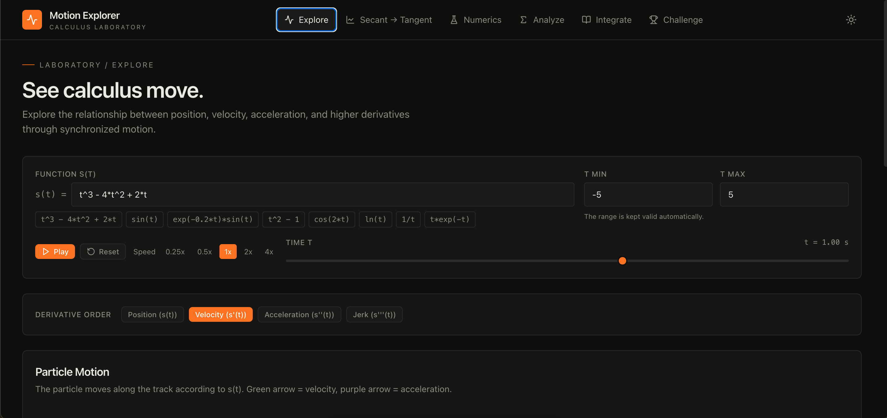
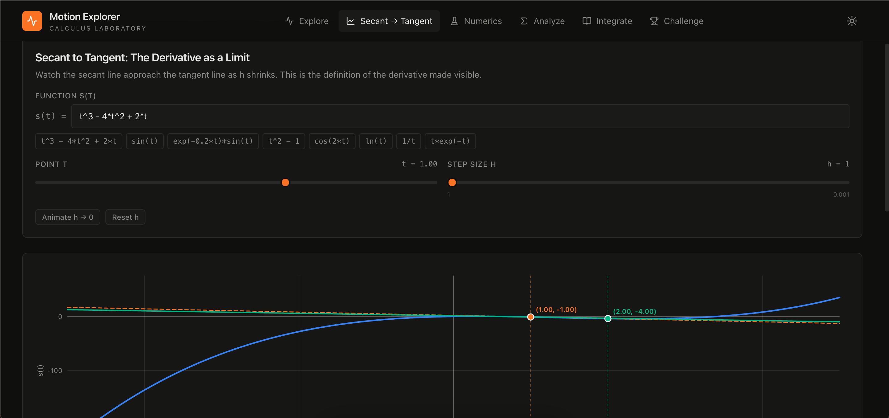
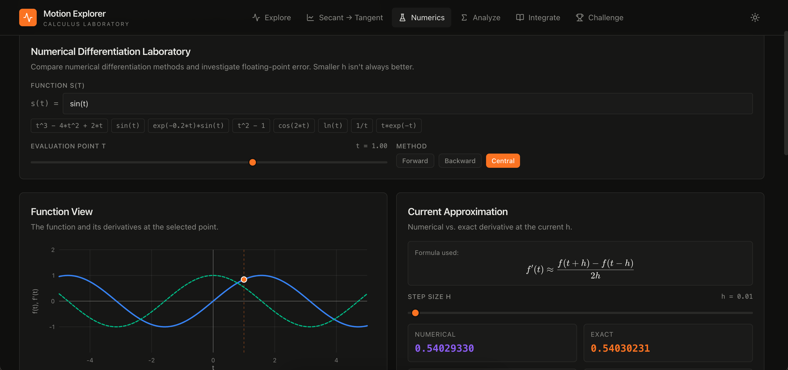
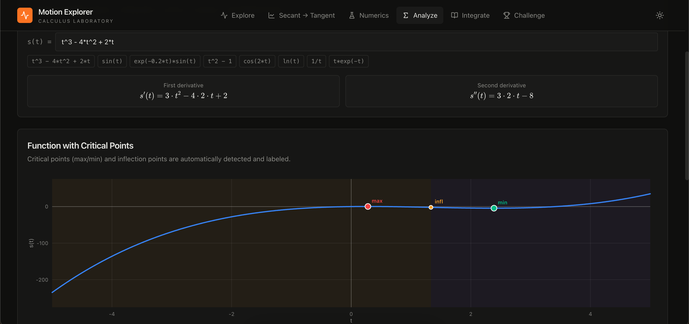
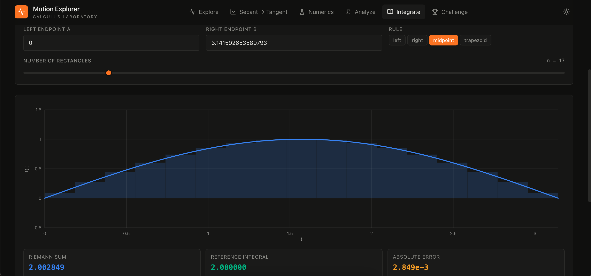
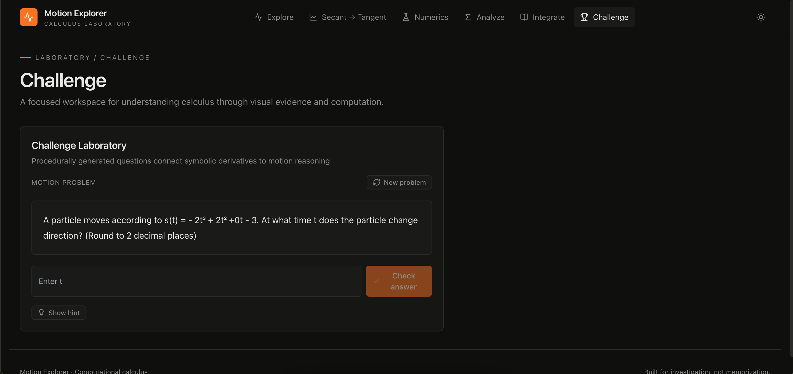

# Motion Explorer

An interactive calculus tool I made to help visualize derivatives, motion, numerical methods, and integration.

**Live site:** [calculus-motion-explorer-axfuj2ixr-srinidhi-kotteswaran.vercel.app](https://calculus-motion-explorer-axfuj2ixr-srinidhi-kotteswaran.vercel.app/)

> **Status:** Active work in progress. I'm continuing to refine the math engine, visualizations, and interactive calculus tools.

## What is Motion Explorer?

I made Motion Explorer because I wanted to be able to *see* what we were doing in calculus instead of just solving problems on paper.

There are currently six parts:

* **Explore** — see position, velocity, acceleration, and higher derivatives
* **Secant → Tangent** — watch the secant line approach the tangent line as `h` gets smaller
* **Numerics** — compare different ways of approximating derivatives
* **Analyze** — find critical points, increasing/decreasing intervals, concavity, and inflection points
* **Integrate** — experiment with Riemann sums and compare them to an actual integral
* **Challenge** — generate calculus problems involving derivatives and motion

## Screenshots

### Explore

### Secant → Tangent

### Numerics

### Analyze

### Integrate

### Challenge

## How I started it

The first version of this project was actually pretty different.

I originally made a small Python app using Streamlit, SymPy, NumPy, and Plotly. It mainly focused on position/velocity graphs, derivatives, and tangent lines.

That version helped me figure out what I actually wanted the project to do. Once I started adding more ideas, though, I wanted more control over the UI and the interactions, so I decided to rebuild it as a web app.

The current version is written in React and TypeScript with Vite.

**Original Python prototype:** [calculus-motion-visualizer](https://github.com/SrinidhiKotteswaran/calculus-motion-visualizer)

I kept the two repositories separate because I like being able to look back at the original version and see how the project changed.

## A little about how it works

Some of the main files are:

* `src/lib/mathEngine.ts` — parsing functions, evaluating them, and symbolic differentiation
* `src/lib/numerics.ts` — numerical differentiation and error calculations
* `src/lib/analysis.ts` — critical points, intervals, and concavity
* `src/components/Graph.tsx` — graphing
* `src/components/ExploreMode.tsx` — position/velocity/acceleration visualization
* `src/components/SecantTangentMode.tsx` — secant and tangent lines
* `src/components/NumericsMode.tsx` — numerical differentiation
* `src/components/AnalyzeMode.tsx` — derivative and concavity analysis
* `src/components/IntegrateMode.tsx` — Riemann sums
* `src/components/ChallengeMode.tsx` — generated calculus problems

## Technologies

* React
* TypeScript
* Vite
* Tailwind CSS
* KaTeX

The original prototype used:

* Python
* Streamlit
* SymPy
* NumPy
* Plotly

## One thing I found interesting

The numerical differentiation section ended up being one of my favorite parts to work on.

It compares forward, backward, and central differences and lets you see how the error changes as the step size `h` changes. I originally expected that making `h` smaller would just keep making the approximation better, but that's not what happens forever. Eventually floating-point errors start to matter.

The Secant → Tangent section came from a similar idea. I wanted to make the definition of a derivative feel more intuitive by actually watching the secant line approach the tangent line.

Those experiments are a big part of why the project grew beyond the original motion visualizer.

## Development

This project is still a work in progress.

I didn't start with the current version planned out. I started with a small Python prototype, figured out what I liked, rebuilt it as a web app, and kept adding things as I learned more calculus and programming.

I'm mainly using the project to get better at numerical methods, interactive visualizations, and building things that actually do something with the math I'm learning.

If I add new features, I'll probably keep experimenting with ways to make calculus concepts easier to play around with rather than just adding more traditional problem-solving tools.
