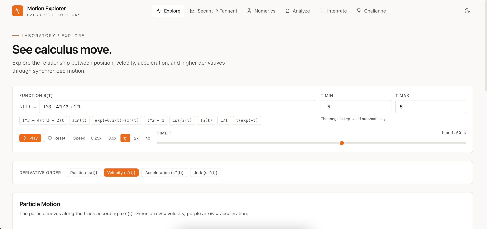
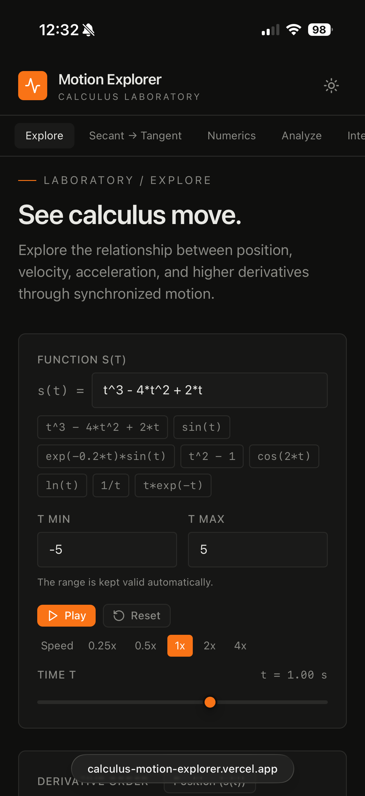
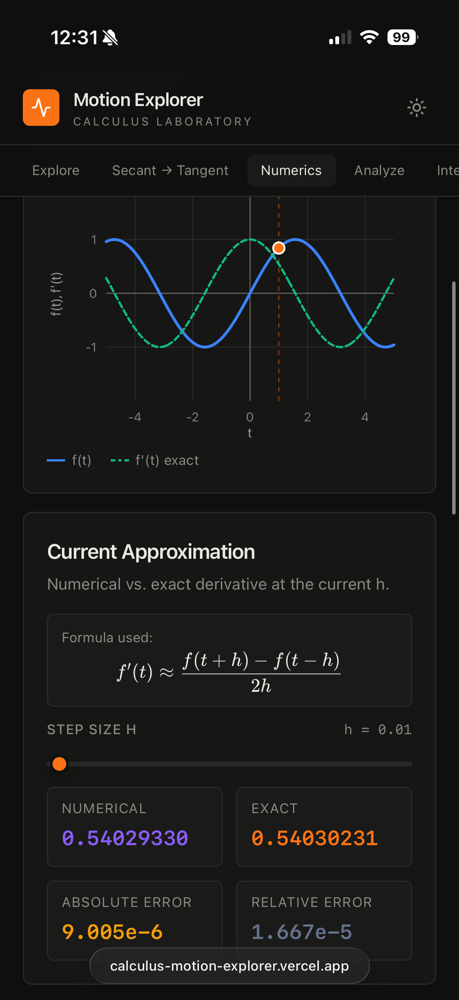

# Motion Explorer

An interactive calculus laboratory I built to make derivatives, motion, numerical methods, analysis, and integration something you can **experiment with**, not just calculate.

**Live site:** https://calculus-motion-explorer-axfuj2ixr-srinidhi-kotteswaran.vercel.app/

## Why I built it

I wanted to be able to *see* what we were doing in calculus instead of only solving problems on paper.

That idea changed the project as I built it. A graph can show a result, but an experiment lets you change an assumption and watch the result respond. Motion Explorer grew around that idea: shrink `h` and watch a secant become a tangent; change `h` far enough and watch floating-point error come back; change a function and see its derivatives and motion change with it.

## What is inside

There are six interactive laboratories:

- **Explore** — position, velocity, acceleration, jerk, and animated particle motion
- **Secant → Tangent** — numerical difference quotients, convergence, and exact symbolic derivatives
- **Numerics** — forward, backward, and central differences plus floating-point error analysis
- **Analyze** — critical points, increasing/decreasing intervals, concavity, and inflection points
- **Integrate** — Riemann sums and numerical integration comparisons
- **Challenge** — procedurally generated calculus and motion problems

## Screenshots

A visual tour of Motion Explorer's interactive laboratories, themes, and responsive interface.

### Core experience

#### Explore

Interactive visualization of a function and its derivatives.


#### Secant → Tangent

Visualizing the limiting process behind the derivative.


#### Numerics

Comparing numerical differentiation methods and approximation error.


#### Analyze

Investigating roots, extrema, inflection points, monotonicity, and concavity.


#### Integrate

Visualizing numerical integration and accumulated area.


#### Challenge

Testing calculus intuition through procedurally generated interactive problems.


### Themes

Motion Explorer supports both dark and light themes.

<table>
  <tr>
    <td align="center"><strong>Dark</strong></td>
    <td align="center"><strong>Light</strong></td>
  </tr>
  <tr>
    <td></td>
    <td></td>
  </tr>
</table>

### Responsive design

The interface adapts to smaller screens while keeping the graphing and controls usable.

<table>
  <tr>
    <td align="center"><strong>Mobile Explore</strong></td>
    <td align="center"><strong>Mobile Numerics</strong></td>
  </tr>
  <tr>
    <td></td>
    <td></td>
  </tr>
</table>

## The technical core

One of the main things I built myself is the symbolic math engine in `src/lib/mathEngine.ts`.

The engine turns an expression into an **abstract syntax tree (AST)** using a custom tokenizer and recursive-descent parser. The same tree can then be numerically evaluated or transformed by a recursive symbolic differentiator.

It implements calculus rules including:

- sum and difference rules
- product and quotient rules
- constant-power and general power rules
- chain-rule forms for supported functions
- trigonometric and inverse-trigonometric derivatives
- hyperbolic, exponential, logarithmic, and square-root derivatives
- expression simplification after differentiation

The original prototype used SymPy. Rebuilding this part in TypeScript made me understand the machinery behind the symbolic operations instead of treating a CAS as a black box.

**Architecture:** [`docs/MATH-ENGINE.md`](docs/MATH-ENGINE.md)

## Numerical experiments

The Numerics laboratory is deliberately more than a calculator. It compares forward, backward, and central differences and plots error against step size on a log-log scale.

The interesting part is the U-shaped error curve: decreasing `h` initially improves the approximation, but eventually floating-point cancellation dominates. The best step size is a balance between truncation error and round-off error.

The repository also includes a repeatable math-engine benchmark:

```bash
npm run benchmark:math
```

See [`docs/BENCHMARKS.md`](docs/BENCHMARKS.md).

## How I built it

Motion Explorer started as a small Python/Streamlit prototype using SymPy, NumPy, and Plotly. That version focused on position/velocity graphs, derivatives, and tangent lines.

As the idea grew, I rebuilt it as a React/TypeScript/Vite application so I could control the interaction more directly. From there, the project evolved from a motion visualizer into a collection of computational calculus experiments.

The build history, design changes, and lessons from that process are documented in [`docs/BUILD-JOURNAL.md`](docs/BUILD-JOURNAL.md).

**Original Python prototype:** https://github.com/SrinidhiKotteswaran/calculus-motion-visualizer

## Project structure

- `src/lib/mathEngine.ts` — parsing, AST evaluation, symbolic differentiation, simplification
- `src/lib/numerics.ts` — numerical differentiation and error calculations
- `src/lib/analysis.ts` — roots, critical points, intervals, and concavity
- `src/components/Graph.tsx` — graphing
- `src/components/ExploreMode.tsx` — motion visualization
- `src/components/SecantTangentMode.tsx` — secant/tangent experiment
- `src/components/NumericsMode.tsx` — numerical differentiation laboratory
- `src/components/AnalyzeMode.tsx` — calculus analysis
- `src/components/IntegrateMode.tsx` — numerical integration
- `src/components/ChallengeMode.tsx` — generated problems

## Verification

The repository includes a focused verification suite for the symbolic engine:

```bash
npm run test:math
```

The checks cover representative symbolic derivatives, numerical evaluation, invalid expressions, and domain failures.

Before a release, I also run:

```bash
npm run typecheck
npm run lint
npm run build
```

## Known limitations

Motion Explorer is an educational computational tool, not a general-purpose computer algebra system. Numerical methods have finite-precision and sampling limitations, and some symbolic expressions have domain restrictions or non-differentiable points.

I keep these limitations explicit because understanding where an algorithm fails is part of understanding the algorithm.

See [`docs/LIMITATIONS.md`](docs/LIMITATIONS.md).

## Technologies

- React
- TypeScript
- Vite
- Tailwind CSS
- KaTeX

The original prototype used Python, Streamlit, SymPy, NumPy, and Plotly.

## Development

```bash
npm install
npm run dev
```

Then open the local Vite URL shown in the terminal.

## Version

**v1.0.0** — first stable milestone of the rebuilt web application.

See [`CHANGELOG.md`](CHANGELOG.md) for the feature summary.
